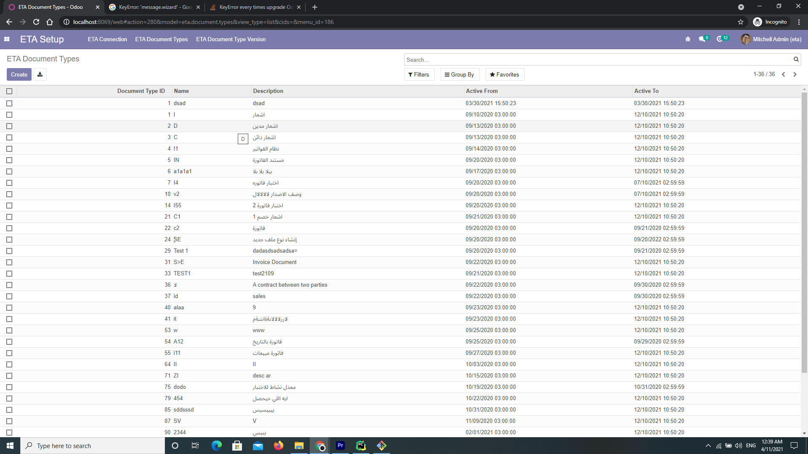

#### **Egyptian Tax Authority**

This Module   connects Odoo 14 community with Egyptian Tax Authority.

**_How You can Use ETA Module By Following simple setup below_**

1.Connect Eta Api
    
    i.by adding client Id and Client Secret
    ii.Then Click Connect To Eta
    
    

_you will get above message on successful connection.
    now you are connect with Eta and ready to pull document types 
    and versions from eta database._
    
iii.Then Click Get ETA Document Types
    
    you will get document types and their version after success.

2.**Create Invoice To ETA**

i.Go To Invoicing Module and click on Invoice Menu 

ii.Click On one Invoice

iii.Here you can see Create Inovice TO ETa and Create Credit Note TO ETA.
you also can change specfic Eta Fields in invoicing tab.

    
